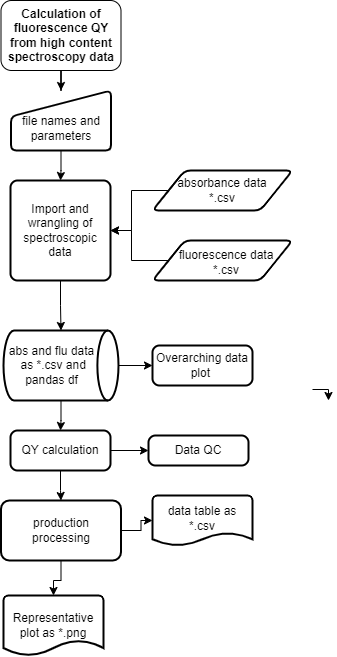

# high_content_quantum_yield
## Contents
* Introduction
* Python environment
* Milestone
* Functions
* Classes
* Running instructions
* References

### Introduction
Project to automat fitting of high conetent flourescent quantum yield measuremnts with an aim to standardise data analysis, quality control, results reporting and graphing of individual stages.

### Python environment
The code writing was started on my older windows manage desktop, using Jupyter notebooks *via* on Anaconda installation. A version of Git was linked to my GitHub account to allow version management and when needed to work on the project on my main Linux laptop. Gets on my manage desktop is slightly wonky the work VPN needs to be connected and ideally I need to work on my C drive, in the windows CMD I can change to the C drive with `C:`. I'd like to ideally use a conda environment for doing this but I haven't got had the chance to set it up yet I will include it in this section when I do.

### Milstones
#### Milestone 1
Loading and initial wrangling of raw bmg clariostar flourecence and absorbtion data into pandas data frames. These data frames have wavelengths as the column names and well number in column 0.

#### Milestone 2
Moving data from the flourecence and absorbtion data frames in to a new plotting data frame.

#### Milestone 3
Bulding data frame `hcqy_plot= pd.DataFrame()` with absorbance at excition wavelength and integrated flourecence intensity for four PS at five concentration and  four repeats. This is done using numpy and pandas I use a the `DataFrame.iloc[]` function from the pandas library it seems to gel well with analysis of UV\vis spectral data. From this data frame I calculate `hcqy_grad = pd.DataFrame()` the the gradients, fitting to a strate line x = ym +c  of absorbance against integrated fluorescence intesity for the data sets in the `hcqy_plot` data frame. This `hcqy_grad` data frame includes the gradient coeffienct, the intercept and the R^2 score as calculated from the `from sklearn.linear_model import LinearRegression` library.

#### Milestone 4
The next step is calulating the quantum yields of the unkown PS \u03A6x.

#### Milestone x 
Building plotsusing `matplotlib` the online documentation is very good for example for marker styles https://matplotlib.org/stable/api/markers_api.html.

### Referecnces

1 S. Dhami, A. J. D. Mello, G. Rumbles, S. M. Bishop, D. Phillips and A. Beeby, Photochem. Photobiol., 1995, 61, 341-346 (DOI:10.1111/j.1751-1097.1995.tb08619.x).

2 A. T. R. Williams, S. A. Winfield and J. N. Miller, Analyst (London), 1983, 108, 1067-1071 (DOI:10.1039/an9830801067).
